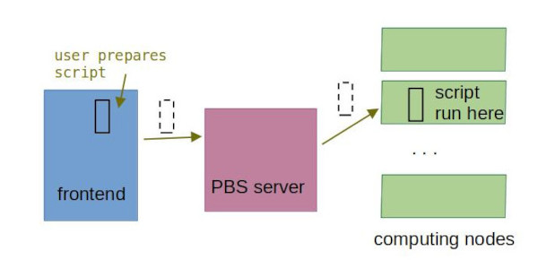
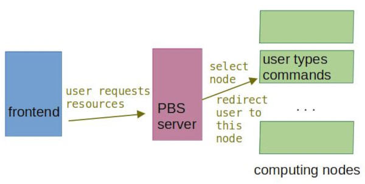
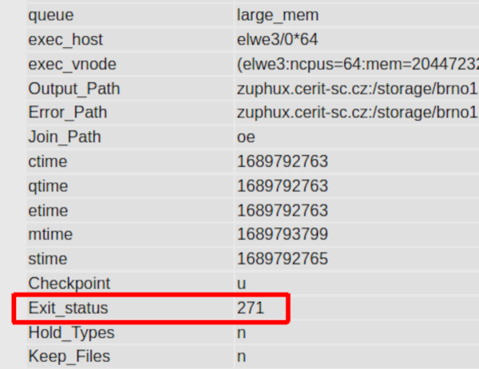
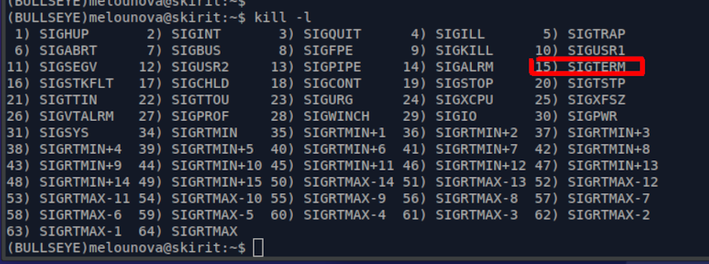

# Computing

Welcome to the basic guide on how to run calculations in Metacentrum grid service. You will learn how to

- navigate between **frontends**, **home directories** and **storages**,
- make use of **batch** and **interactive** job,
- **submit a job** to a **PBS server**,
- set up **resources** for a job,
- retrieve job **output**.

*Most topics mentioned here are covered to greater depth in the [Advanced](/advanced/connect-auth) section.*

!!! note "To start, you need to"

    1. have Metacentrum account
    2. be able to login to a frontend node
    3. have elementary knowledge of Linux command line
 
    *If anything is missing, see [Access](/access/terms) section.*

## Lifecycle of a job

### Batch job

A typical usecase for grid computing is non-interactive batch job, when the user only prepares input and set of instructions at the beginning. The calculation itself then runs independently on user.

Batch jobs consists of the following steps:

1. **User prepares data** to be used in the calculation **and instructions** what is to be done with them (input files + batch script).
2. The batch script is submitted to the job planner (**PBS server**), which stages the job until required resources are available.
3. After the PBS server has released the job to be run, **the job runs** on one of computational nodes.
4. At this time the applications (software) are loaded.
5. When the job is finished, results are copied back to user's directory according to instructions in the batch script.

### Interactive job

Interactive job works in different way. User does not need to specify in advance what will be done, neither does not need to prepare any input data. Instead they first reserve computational resources and after the job start to run, works interactively on CLI.

Interactive job consists of following steps:

1. User **submits request for specified resources** to the PBS server
2. **PBS server stages** this request until the resources are available.
3. When the job starts running, **user is redirected** to a computational node's CLI.
4. **User does whatever they need** on the node. 
5. When the user logs out of the computational node, or when the time reserved for the job runs out, the job is done.

### Batch vs interactive

A primary choice for grid computing is batch job. Batch jobs allow user to run massive sets of calculation without need to overview them, manipulate data etc. They also optimize the usage of computational resources better, as there is no need to wait for user's input. 

Interactive jobs are good for:

- testing what works and what does not (software versions, input data format, bash constructions to be used in batch script later etc)
- getting first guess about resources
- compiling your own software
- processing, moving or archiving large amount of data

Interactive jobs are **necessary** for [running GUI application](/advanced/run-graphical/).

## Batch job example

The batch script in the following example is called myJob.sh.

    (BUSTER)user123@skirit:~$ cat myJob.sh
    #!/bin/bash
    #PBS -N batch_job_example
    #PBS -l select=1:ncpus=4:mem=4gb:scratch_local=10gb
    #PBS -l walltime=1:00:00 
    # The 4 lines above are options for scheduling system: job will run 1 hour at maximum, 1 machine with 4 processors + 4gb RAM memory + 10gb scratch memory are requested
    
    # define a DATADIR variable: directory where the input files are taken from and where output will be copied to
    DATADIR=/storage/brno12-cerit/home/user123/test_directory # substitute username and path to to your real username and path
    
    # append a line to a file "jobs_info.txt" containing the ID of the job, the hostname of node it is run on and the path to a scratch directory
    # this information helps to find a scratch directory in case the job fails and you need to remove the scratch directory manually 
    echo "$PBS_JOBID is running on node `hostname -f` in a scratch directory $SCRATCHDIR" >> $DATADIR/jobs_info.txt
    
    #loads the Gaussian's application modules, version 03
    module add g03
    
    # test if scratch directory is set
    # if scratch directory is not set, issue error message and exit
    test -n "$SCRATCHDIR" || { echo >&2 "Variable SCRATCHDIR is not set!"; exit 1; }
    
    # copy input file "h2o.com" to scratch directory
    # if the copy operation fails, issue error message and exit
    cp $DATADIR/h2o.com  $SCRATCHDIR || { echo >&2 "Error while copying input file(s)!"; exit 2; }
    
    # move into scratch directory
    cd $SCRATCHDIR 
    
    # run Gaussian 03 with h2o.com as input and save the results into h2o.out file
    # if the calculation ends with an error, issue error message an exit
    g03 <h2o.com >h2o.out || { echo >&2 "Calculation ended up erroneously (with a code $?) !!"; exit 3; }
    
    # move the output to user's DATADIR or exit in case of failure
    cp h2o.out $DATADIR/ || { echo >&2 "Result file(s) copying failed (with a code $?) !!"; exit 4; }
    
    # clean the SCRATCH directory
    clean_scratch

The job is then submitted as

    (BUSTER)user123@skirit:~$ qsub myJob.sh 
    11733571.meta-pbs.metacentrum.cz # job ID is 11733571.meta-pbs.metacentrum.cz

Alternatively, you can specify resources on the command line. In this case the lines starting by `#PBS` need not to be in the batch script.

    (BUSTER)user123@skirit:~$qsub -l select=1:ncpus=4:mem=4gb:scratch_local=10gb -l walltime=1:00:00 myJob.sh 

!!! note
    If both resource specifications are present (on CLI as well as inside the script), the values on CLI have priority.

## Interactive job example

An interactive job is requested via `qsub -I` command (uppercase "i").

    (BUSTER)user123@skirit:~$ qsub -I -l select=1:ncpus=4 -l walltime=2:00:00 # submit interactive job 
    qsub: waiting for job 13010171.meta-pbs.metacentrum.cz to start
    qsub: job 13010171.meta-pbs.metacentrum.cz ready # 13010171.meta-pbs.metacentrum.cz is the job ID
    (BULLSEYE)user123@elmo3-1:~$ # elmo3-1 is computational node
    (BULLSEYE)user123@elmo3-1:~$ conda # start conda
    (BULLSEYE)user123@elmo3-1:~$ conda list | grep scipy # make sure there is no scipy package already installed
    (BULLSEYE)user123@elmo3-1:~$ conda search scipy 
    ... # conda returns list of scipy packages available in repositories
    (BULLSEYE)user123@elmo3-1:~$ conda --create my_scipy # create my environment to install scipy into
    ... 
    environment location: /storage/praha1/home/melounova/.conda/envs/my_scipy 
    ...
    Proceed ([y]/n)? y
    ...
    (BULLSEYE)user123@elmo3-1:~$ conda activate my_scipy # enter the environment
    (my_scipy) (BULLSEYE)user123@elmo3-1:~$ 
    (my_scipy) (BULLSEYE)user123@elmo3-1:~$ conda install scipy
    ...
    Proceed ([y]/n)? y
    ...
    Downloading and Extracting Packages
    ...
    (my_scipy) (BULLSEYE)user123@elmo3-1:~$ python
    ...
    >>> import scipy as sp
    >>> 

Unless you log out, after 1 hour you will get following message:

    user123@elmo3-1:~$ =>> PBS: job killed: walltime 7230 exceeded limit 7200
    logout
    qsub: job 13010171.meta-pbs.metacentrum.cz completed

## job ID

Job ID is unique identifier in a job. Job ID is crucial to track, manipulate or delete job, as well as to identify your problem to user support.

Under some circumstances the job can be identified by the number only (e.g. `13010171.`). In general, however, the PBS server suffix is needed, too, to fully identify the job (e.g. `13010171.meta-pbs.metqcentrum.cz`).  

You can get the job ID:

- after running `qsub` command
- by `echo $PBS_JOBID` in interactive job  or in the batch script
- by `qstat -u your_username @meta-pbs.metacentrum.cz @cerit-pbs.cerit-sc.cz @elixir-pbs.elixir-czech.cz`

Within interactive job:

    (BULLSEYE)user123@elmo3-1:~$ echo $PBS_JOBID
    13010171.meta-pbs.metacentrum.cz

By `qstat` command:

    (BULLSEYE)user123@elmo3-1s :~$ qstat -u user123 @meta-pbs.metacentrum.cz @cerit-pbs.cerit-sc.cz @elixir-pbs.elixir-czech.cz 
    
    elixir-pbs.elixir-czech.cz: 
                                                                 Req'd  Req'd   Elap
    Job ID               Username Queue    Jobname    SessID NDS TSK Memory Time  S Time
    -------------------- -------- -------- ---------- ------ --- --- ------ ----- - -----
    13010171.meta-pbs.m* user123  global   STDIN      366884   1   8    4gb 02:00 R 00:17

## Job status

Basic command for getting status about your jobs is `qstat` command.

    qstat -u user123 # list all jobs of user "user123" running or queuing on the current PBS server
    qstat -u user123 @meta-pbs.metacentrum.cz @cerit-pbs.cerit-sc.cz @elixir-pbs.elixir-czech.cz # list all running or queuing jobs of user "user123" on all PBS servers
    qstat -xu user123 # list finished jobs for user "user123" 
    qstat -f <jobID> # list details of the running or queueing job with a given jobID
    qstat -xf <jobID> # list details of the finished job with a given jobID

You will see something like following table:

                                                                     Req'd  Req'd   Elap
    Job ID               Username Queue    Jobname    SessID NDS TSK Memory Time  S Time
    -------------------- -------- -------- ---------- ------ --- --- ------ ----- - -----
    11733550.meta-pbs.*  user123 q_2h     myJob.sh         --    1   1    1gb 00:05 Q   --

The letter under the header 'S' (status) gives the status of the job. The most common states are:

- Q – queued
- R – running
- F – finished
- M – moved to another PBS server

To learn more about how to track running job and how to retrieve job history, see [Job tracking page](/advanced/job-tracking).

## Output files

When a job is completed (no matter how), two files are created in the directory from which you have submitted the job:

1. `<job_name>.o<jobID>` - job's standard output (STDOUT)
2. `<job_name>.e<jobID>` - job's standard error output (STDERR)

STDERR file contains all the error messages which occurred during the calculation. It is a first place where to look if the job has failed.

## Job termination

### Done by user

Sometimes you need to delete submitted/running job. This can be done by `qdel` command:

    (BULLSEYE)user123@skirit~: qdel 21732596.elixir-pbs.elixir-czech.cz

If plain `qdel` does not work, add `-W` (force del) option:

    (BULLSEYE)user123@skirit~: qdel -W force 21732596.elixir-pbs.elixir-czech.cz

### Done by PBS server

The PBS server keeps track of resources used by the job. In case the job uses more resources than it has reserved, PBS server sends a **SIGKILL** signal to the execution host.

You can see the signal as `Exit_status` on CLI:

    (BULLSEYE)user123@tarkil:~$ qstat -x -f 13030457.meta-pbs.metacentrum.cz | grep Exit_status
        Exit_status = -29

In case of moved (PBS code **M**) jobs, append to job ID the name of the PBS server the job was moved to: 

    (BULLSEYE)user123@tarkil:~$ qstat -x -f 13031539.meta-pbs.metacentrum.cz@cerit-pbs.cerit-sc.cz | grep Exit_status
        Exit_status = 0

## Exit status

When the job is finished (no matter how), it exits with a certain **exit status** (a number).

!!! note "Exit status is meaningful only for batch jobs"
    Interactive jobs have always exit status equal to 0.

A normal termination is denominated by 0.

Any non-zero exit status means the job failed for some reason.

You can get the exit status by typing

    (BULLSEYE)user123@skirit:~$ qstat -xf job_ID | grep Exit_status
    Exit_status = 271

!!! warning "For older jobs, use pbs-get-job-history"
    The `qstat -x -f` works only for recently finished jobs (last 24 hours). For For older jobs, use the `pbs-get-job-history` utility - see [Advanced chapter on getting info about older jobs](http://localhost:8080/advanced/job-tracking/#older).

Alternatively, you can navigate to [your list of jobs in PBSmon](https://metavo.metacentrum.cz/pbsmon2/jobs/detail), go to tab "Jobs" and choose a particular finished job from the list.

A gray table at the bottom of the page contains many variables connected to the job. Search for "Exit status" like shown in the picture below:

### Exit status ranges

Exit status can fall into one of three categories, or ranges of numbers.

| Exit status range  | Meaning |
|--------------------|---------------------|
| X < 0              | job killed by PBS; either some resource was exceeded  or another problem occured |
| 0 <= X < 256       | exit value of shell or top process of the job |
| X >= 256           | job was killed with an OS signal |

### Exit status to `SIG*` type

If the exit status exceeds 256, it means an signal from operation system has terminated the job.

Usually this means the used has deleted the job by `qdel`, upon which a `SIGKILL` and/or `SIGTERM` signal is sent.

The OS signal have an OS code of their own.

Type `kill -l` on any frontend to get list of OS signals together with their values.

To translate PBS exit code >= 256 to OS signal type, just subtract 256 from exit code.

For example, exit status of 271 means the OS signal no. 15 (a `SIGTERM`).

!!! tip
    `PBS exit status` - `256` = `OS signal code`.

### Common exit statuses

Most often you will meet some of the following signals:

| Type of job ending |  Exit status  |
|--------------------|---------------|
| missing Kerberos credenials | -23 |
| job exceeded number of CPUs     | -25 |
| job exceeded memory             | -27 |
| job exceeded walltime           | -29 |
| **normal termination**      | **0** |
| Job killed by `SIGTERM`  (result of `qdel`) | 271  |

## Manual scratch clean

In case of erroneous job ending, the data are left in the scratch directory. You should always clean the scratch after all potentially useful data has been retrieved. To do so, you need to know the hostname of machine where the job was run, and path to the scratch directory.

!!! note
    Users' rights allow only `rm -rf $SCRATCHDIR/*`, not `rm -rf $SCRATCHDIR`.

For example:

    user123@skirit:~$ ssh user123@luna13.fzu.cz # login to luna13.fzu.cz
    user123@luna13:~$ cd /scratch/user123/job_14053410.meta-pbs.metacentrum.cz # enter scratch directory
    user123@luna13:/scratch/user123/job_14053410.meta-pbs.metacentrum.cz$ rm -r * # remove all content

The scratch directory itself will be **deleted automatically** after some time.

